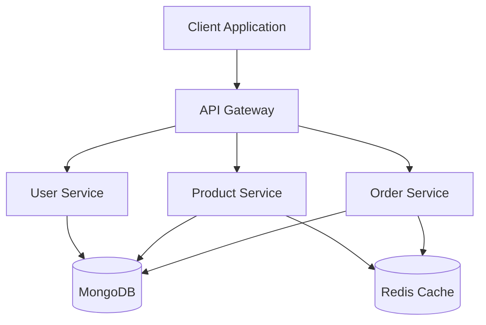
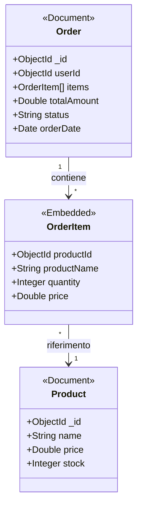
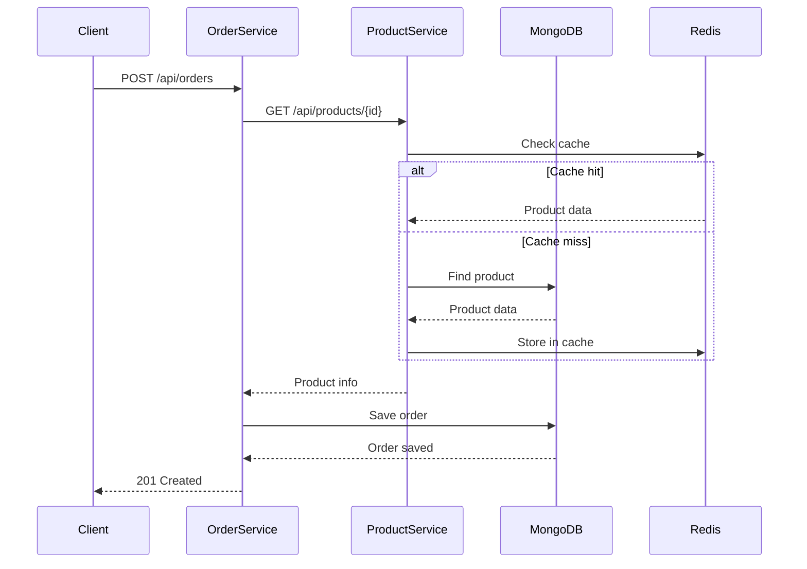
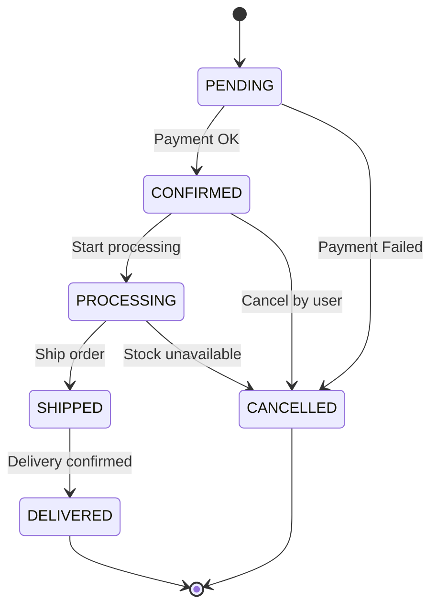
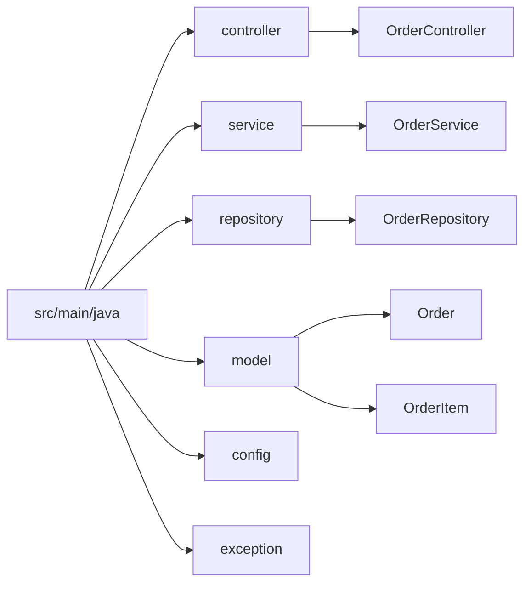
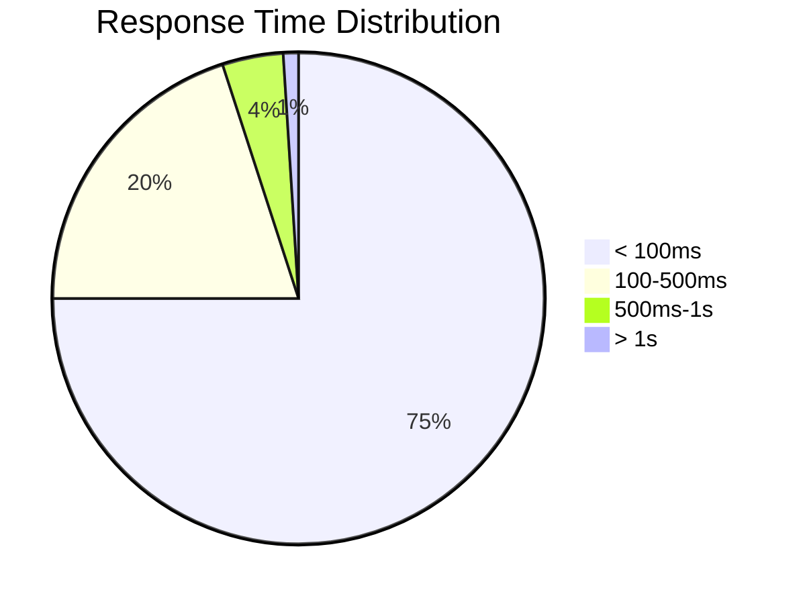
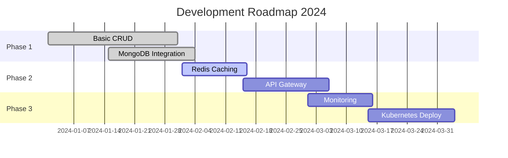

# E-Commerce Microservice

Microservizio Spring Boot per la gestione di ordini e-commerce con MongoDB.

## Architettura



## Modello Dati

### Schema MongoDB



## Flusso di Creazione Ordine



## Stati dell'Ordine



## Struttura del Progetto



## Tecnologie Utilizzate

- **Java 17**
- **Spring Boot 3.x**
- **Spring Data MongoDB**
- **Spring Cloud**
- **Redis** per caching
- **Docker** per containerizzazione

## Quick Start

### Prerequisiti

- Java 17+
- Docker & Docker Compose
- Maven 3.8+

### Avvio con Docker Compose

```bash
# Clona il repository
git clone https://github.com/tuoaccount/ecommerce-service.git

# Avvia i servizi
docker-compose up -d

# Build del progetto
mvn clean install

# Avvia l'applicazione
mvn spring-boot:run
```

### Configurazione MongoDB

```yaml
spring:
  data:
    mongodb:
      uri: mongodb://localhost:27017/ecommerce
      database: ecommerce
```

## API Endpoints

| Metodo | Endpoint | Descrizione |
|--------|----------|-------------|
| GET | `/api/orders` | Lista tutti gli ordini |
| GET | `/api/orders/{id}` | Dettagli ordine |
| POST | `/api/orders` | Crea nuovo ordine |
| PUT | `/api/orders/{id}` | Aggiorna ordine |
| DELETE | `/api/orders/{id}` | Cancella ordine |

## Testing

```bash
# Unit tests
mvn test

# Integration tests
mvn verify -P integration-tests
```

## Performance



## Roadmap



## Contribuire

1. Fork del progetto
2. Crea un branch (`git checkout -b feature/amazing-feature`)
3. Commit delle modifiche (`git commit -m 'Add amazing feature'`)
4. Push al branch (`git push origin feature/amazing-feature`)
5. Apri una Pull Request

## Licenza

MIT License - vedi file [LICENSE](LICENSE) per dettagli.

## Contatti

Il tuo Nome - [@tuoaccount](https://twitter.com/tuoaccount)

Project Link: [https://github.com/tuoaccount/ecommerce-service](https://github.com/tuoaccount/ecommerce-service)